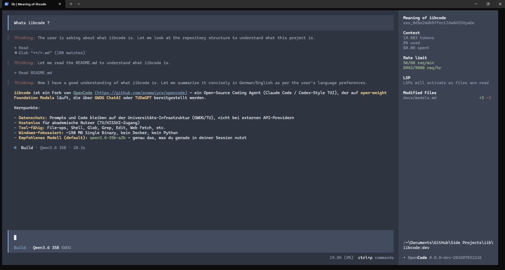

# iibcode

An open-source coding agent that runs on open-weight foundation models provided by **GWDG ChatAI** or **TUDaGPT**. Claude Code style interactive TUI. Free for academic use, prompts and code stay on university infrastructure. Fork of [opencode](https://github.com/anomalyco/opencode); model list and config will drift, breaking changes likely.

<p align="center">
  
</p>

<p align="center">
  
</p>

## Features

- 🔒 **Data stays on university infrastructure:** Prompts, code, and conversations go to GWDG or TUDaGPT, not to closed-API providers.
- 🆓 **Free for academic users:** Covered by KISSKI / TU institutional access; no per-token billing or external contracts.
- 🧠 **Tool-capable open-weight models:** Coding, reasoning, and agentic flagships (see [Recommended models](#recommended-models-for-agentic-coding) below).
- 🛠️ **Agentic TUI:** Claude Code / Codex-style coding assistant with file ops, shell, glob, grep, edit, web fetch.
- 📊 **Live rate-limit display:** GWDG request budget (req/min, req/hr) in the TUI sidebar, read from the API's `x-ratelimit-*` headers; retries back off using the real numbers.
- 🔁 **`/models-refresh`:** TUI command re-syncs the model list, tool-call support, and per-model context limits against the live GWDG catalog.
- 🪟 **Single ~150 MB binary, Windows-first:** No Docker, no Python virtualenv. Setup script and docs target Windows + PowerShell; macOS/Linux build from source but are untested.
- 🔄 **Tracks upstream cleanly:** Pulls [anomalyco/opencode](https://github.com/anomalyco/opencode) improvements via `merge=ours`; iibcode customizations stay intact.

## Recommended models for agentic coding

<!-- Snapshot from the GWDG ChatAI live API; keep in sync with docs/models.md -->
*Snapshot: July 2026.*

| Model | Description |
|---|---|
| `qwen3.6-35b-a3b` | **recommended default** |
| `devstral-2-123b-instruct-2512` | Mistral's coding-tuned model |
| `glm-4.7` | GWDG's coding-marketed pick |
| `qwen3.5-397b-a17b` | Flagship Qwen with thinking |
| `mistral-large-3-675b-instruct-2512` | Mistral flagship, general-purpose |

GWDG's official *standard recommendation* is `meta-llama-3.1-8b-instruct` for general use; see [GWDG's model overview](https://docs.hpc.gwdg.de/services/ai-services/chat-ai/models/index.html) for their full positioning. GWDG retires models continously. Currently 14 tool-capable models configured in [docs/models.md](docs/models.md).

## Prerequisites

- **Bun** ≥ 1.3 — `irm https://bun.com/install.ps1 | iex` on Windows, or see [bun.sh](https://bun.sh)
- **Git**
- A **GWDG API key** — request one at the [KISSKI LLM Service page](https://kisski.gwdg.de/leistungen/2-02-llm-service/) (German academic affiliation required; allow ~1 week for approval)
- *(optional)* A **TUDaGPT API key** from TU Darmstadt HRZ — only works on the TU network

## Setup

One command, from **inside the freshly-cloned repo**:

```powershell
git clone https://git-ce.rwth-aachen.de/tuda-iib/iibai/iibcode.git
cd iibcode
bun run setup
```

`bun run setup` installs dependencies, builds the `iibcode` binary and puts it on your PATH, syncs the provider config globally, and prompts for your GWDG API key. Then **open a new terminal** (so the key is visible) and jump to [Use it](#use-it).

### Where the API key lives

`bun run setup` stores your key as a **user environment variable** named `GWDG_API_KEY`. `opencode.json` references it as `{env:GWDG_API_KEY}` and resolves it at runtime, so the key never lands in a file or a commit. To set it by hand instead of via the script:

- **Windows:** `[Environment]::SetEnvironmentVariable("GWDG_API_KEY", "your-key", "User")`
- **macOS/Linux:** `echo 'export GWDG_API_KEY="your-key"' >> ~/.zshrc`  *(or `~/.bashrc`)*

Either way, open a fresh shell afterwards so the variable is visible.

<details>
<summary><b>What <code>bun run setup</code> does (run these by hand instead)</b></summary>

```powershell
bun install --ignore-scripts                                          # deps (see docs/troubleshooting.md if it errors)
bun run iibcode:build                                                 # → dist/iibcode.exe (~150 MB, 1–3 min)
Copy-Item dist\iibcode.exe "$env:USERPROFILE\.bun\bin\iibcode.exe"    # put it on PATH
bun run setup:global-config                                           # writes ~/.config/opencode/opencode.json
```

(macOS/Linux: `cp dist/iibcode ~/.bun/bin/iibcode`, or `sudo cp dist/iibcode /usr/local/bin/iibcode`.)

**Global config** makes the `gwdg/...` models — and the `enabled_providers` allowlist that hides opencode.ai's free models — visible from any working directory. Re-run `bun run setup:global-config -- --force` after editing the project `opencode.json` to keep the two in sync. Path is `$XDG_CONFIG_HOME/opencode/`, defaulting to `~/.config/opencode/` on every platform (Windows opencode follows XDG, not `%APPDATA%`).

</details>

## Use it

```bash
cd path/to/your/project
iibcode      
```


## Roadmap

- **TUDaGPT** as a second provider once the base URL and auth are available
- **Blablador** (Helmholtz AI / FZ Jülich) as a third provider planned (Kimi K2.7, MiniMax)

## Documentation

| | |
|---|---|
| [docs/models.md](docs/models.md) | Full list of GWDG models, capabilities |
| [docs/troubleshooting.md](docs/troubleshooting.md) | Sophos EPERM workaround, Windows symlink trap, `bun install` quirks |
| [docs/development.md](docs/development.md) | `bun dev`, rebuild flow, custimizations|
| [docs/architecture.md](docs/architecture.md) | Architecture overview |
| [docs/fork-changes.md](docs/fork-changes.md) | List of changes from upstream opencode |
| [docs/release.md](docs/release.md) | Releasing the Windows binary |
| [docs/maintainer-sync.md](docs/maintainer-sync.md) | Pulling updates from `anomalyco/opencode` |
| [docs/upstream-readme/](docs/upstream-readme/) | Original OpenCode README |

> **Upstream sync** (replaces GitHub's "Sync fork" button):
> ```bash
> git fetch upstream && git merge upstream/dev && git push origin dev
> ```
> See [docs/maintainer-sync.md](docs/maintainer-sync.md) for first-time setup and caveats.

## License

iibcode, a fork of [opencode](https://github.com/anomalyco/opencode), remains MIT-licensed.
