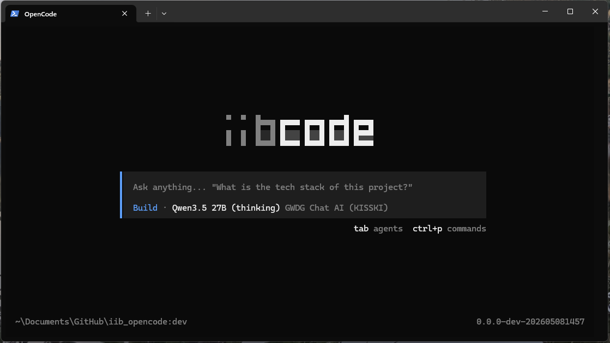

# iibcode

An open-source coding agent that runs on open-weight foundation models provided by **GWDG ChatAI** or **TUDaGPT**. Claude Code / Codex / Aider-style interactive TUI — free for academic use, prompts and code stay on university infrastructure. Personal/experimental fork of [opencode](https://github.com/anomalyco/opencode); model list and config will drift, breaking changes likely.

<p align="center">
  
</p>

## Features

- 🔒 **Data stays on university infrastructure** — prompts, code, and conversations go to GWDG or TUDaGPT, not to closed-API providers.
- 🆓 **Free for academic users** — covered by KISSKI / TU institutional access; no per-token billing or external contracts.
- 🧠 **13 tool-capable open-weight models** — coding, reasoning, and agentic flagships (see [Recommended models](#recommended-models-for-agentic-coding) below).
- 🛠️ **Agentic TUI** — Claude Code / Codex / Aider-style coding assistant with file ops, shell, glob, grep, edit, web fetch.
- 🪟 **Single ~150 MB binary** — Windows / macOS / Linux native; no Docker, no Python virtualenv.
- 🔄 **Tracks upstream cleanly** — pulls [anomalyco/opencode](https://github.com/anomalyco/opencode) improvements via `merge=ours`; iibcode customizations stay intact.

## Recommended models for agentic coding

<!-- Snapshot from the GWDG ChatAI live API; keep in sync with docs/models.md -->
*Snapshot: May 2026.*

| Model | Best for |
|---|---|
| `qwen3-coder-30b-a3b-instruct` | Daily coding, fast iteration — **iibcode default** (256k context) |
| `devstral-2-123b-instruct-2512` | Heavier coding / refactors — Mistral's coding-tuned model |
| `glm-4.7` | Multilingual agentic flows — GWDG's coding-marketed pick |
| `qwen3.5-397b-a17b` | Complex reasoning + coding — flagship Qwen with thinking |
| `mistral-large-3-675b-instruct-2512` | Maximum capability — Mistral flagship, general-purpose |

GWDG's official *standard recommendation* is `meta-llama-3.1-8b-instruct` for general use; see [GWDG's model overview](https://docs.hpc.gwdg.de/services/ai-services/chat-ai/models/index.html) for their full positioning. 13 tool-capable models in total — full catalog (including 8 listed-but-not-yet-tool-capable) in [docs/models.md](docs/models.md).

## Prerequisites

- **Bun** ≥ 1.3 — `irm https://bun.com/install.ps1 | iex` on Windows, or see [bun.sh](https://bun.sh)
- **Git**
- A **GWDG API key** — request one at the [KISSKI LLM Service page](https://kisski.gwdg.de/leistungen/2-02-llm-service/) (German academic affiliation required; allow ~1 week for approval)
- *(optional)* A **TUDaGPT API key** from TU Darmstadt HRZ — only works on the TU network

## Setup

Clone, install dependencies, store the API key:

```powershell
git clone https://git-ce.rwth-aachen.de/tuda-iib/iibai/iibcode.git
cd iibcode
bun install --ignore-scripts          # see docs/troubleshooting.md if this hangs or errors
[Environment]::SetEnvironmentVariable("GWDG_API_KEY", "your-key-here", "User")
# open a fresh shell so the env var is visible
```

The key is referenced in `opencode.json` as `{env:GWDG_API_KEY}` and resolved at runtime — never committed.

## Build the `iibcode` binary

Compile a standalone `iibcode` binary so you can launch the TUI from any project folder:

```powershell
bun run iibcode:build                                                  # → dist/iibcode.exe (~150 MB, 1–3 min)
Copy-Item dist\iibcode.exe "$env:USERPROFILE\.bun\bin\iibcode.exe"     # put it on PATH
iibcode --version
```

(macOS/Linux: `cp dist/iibcode ~/.bun/bin/iibcode`, or `sudo cp dist/iibcode /usr/local/bin/iibcode`.)

**Make the GWDG provider config global.** Drop a copy of `opencode.json` into the user-level config dir so the `gwdg/...` models are visible from any working directory. Windows opencode follows the XDG spec (`~/.config/opencode/`), not `%APPDATA%`:

```powershell
$cfgDir = "$env:USERPROFILE\.config\opencode"
New-Item -ItemType Directory -Force -Path $cfgDir | Out-Null
Copy-Item opencode.json "$cfgDir\opencode.json"
```

(macOS/Linux: `mkdir -p ~/.config/opencode && cp opencode.json ~/.config/opencode/`.)

## Use it

```bash
cd path/to/your/project
iibcode                                                                # interactive TUI
iibcode run "explain the auth flow" -m gwdg/qwen3-coder-30b-a3b-instruct  # one-shot
```

`gwdg/qwen3-coder-30b-a3b-instruct` is the recommended default for coding work. Inside the TUI, `/models` lists all configured GWDG models.

## Roadmap

- **TUDaGPT** as a second provider once the base URL and auth are available
- Per-model `limit.context` / `limit.output` tuning in `opencode.json` (currently conservative 128k guesses)
- Trim the default tool set for smaller open-weight models that get confused by 15+ tools
- Qwen-tuned system prompt bound via opencode's agent config

## Documentation

| | |
|---|---|
| [docs/models.md](docs/models.md) | Full list of GWDG models, capabilities, and how to re-probe |
| [docs/troubleshooting.md](docs/troubleshooting.md) | Sophos EPERM workaround, Windows symlink trap, `bun install` quirks |
| [docs/development.md](docs/development.md) | `bun dev`, rebuild flow, what's customized in this fork |
| [docs/maintainer-sync.md](docs/maintainer-sync.md) | Pulling updates from `anomalyco/opencode` upstream |
| [docs/upstream-readme/](docs/upstream-readme/) | Original OpenCode README (English + 21 translations) |

## License

iibcode, a fork of OpenCode, remains MIT-licensed.
